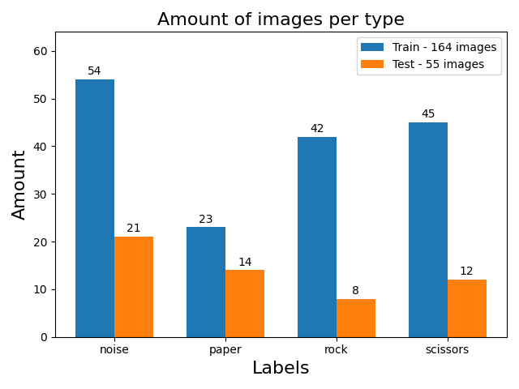

# ML-rock-paper-scissors

Machine learning application for game Rock-Paper-Scissors

## What is it?

Main purpose is to make algorithm to classify picture of hand to certain class, which is rock, paper or scissors.
Alternatively application can be used for any set of pictures.  

## Used technologies:

```
$ Python
$ joblib
$ matplotlib
$ numpy
$ pandas
$ Pillow
$ scikit-learn
```

## Installation

It is best to use the python `virtualenv` tool to build locally:

```
$ git clone https://github.com/BartekStok/ML-rock-paper-scissors
$ cd 05_ml_rps_game
$ virtualenv -p python3 venv
$ source venv/bin/activate
$ pip3 install -r requirements.txt
```

## Usage

1. First go to `settings.py` and set path to picture folders. Then set 
 names for labels. Folders must be named just like the labels to recognize.
Lastly choose size of picture. <br><br>
2. Go to `preprocess.py` and run the program. Be aware that all pictures
in given paths will be resized to chosen size! In data folder inside rps_model
will appear files named after folder name. <br><br>
3. Run file `model_train.py`. There should appear plot with random samples
like: <br><br>
 <br><br>
Plot with amounts of data to process: <br>
 <br><br>
And Confusion matrix with model data as is and in percentage:
 <br>
Also in python console will be printed all model scores i.e. Accuracy, Precision,
Recall, and F1 Score.<br><br>
4. If You want to run full cross validation with various solvers,
then in `model_train.py` is a section with cross validation
function, uncomment it and run file. Be aware that it takes long
time to compute, depending from amount of data.<br><br>
5. At the very bottom of the `model_train.py` file, there
is a section to train final model with all data available, and
to export model to a file. Uncomment for execution. <br><br>
6. Next step is `varia.py`, where, after running the file, and
with given results from cross validation, two plots should appear: <br>


It is a comparison of data from cross validation with different
solvers. <br><br>
7. Last step is to predict. File `predict.py` is for that, it loads 
saved model, then after setting up proper path to an image,
prediction should be made.


## License

This project is licensed under the MIT License 

- Copyright 2020 © Bartłomiej Stokłosa